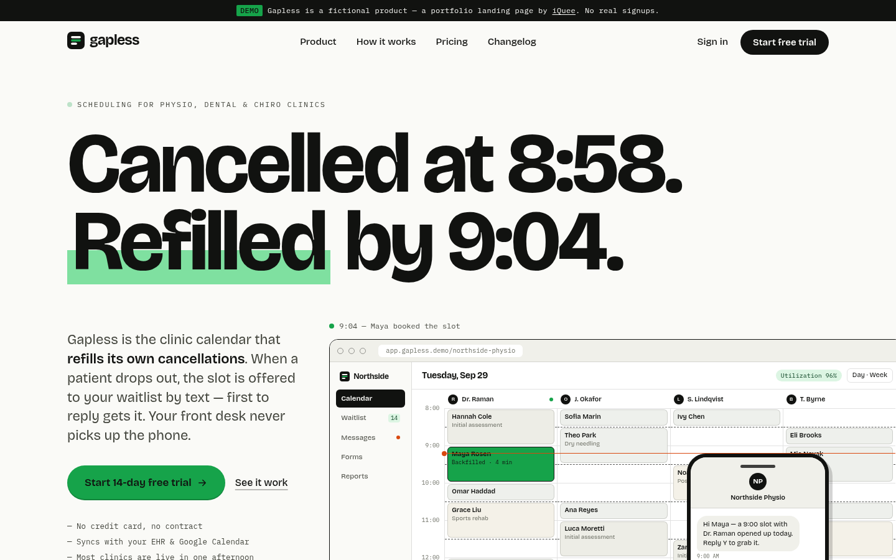
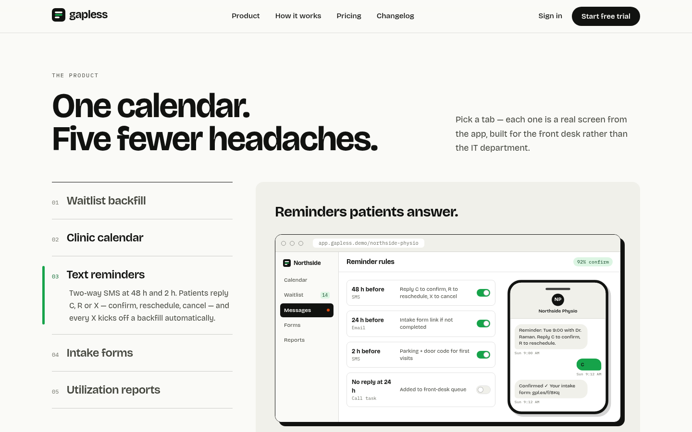
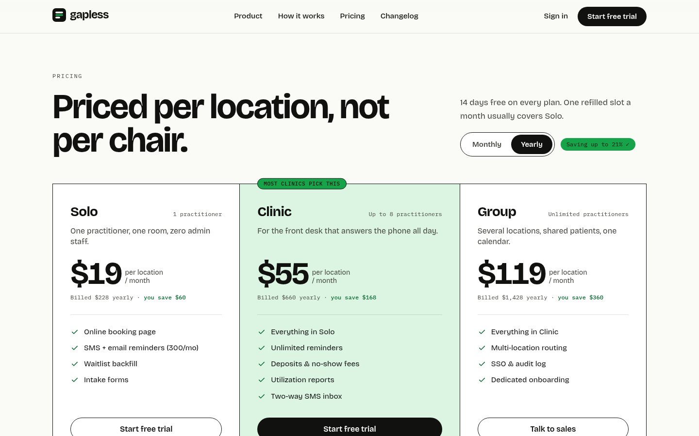
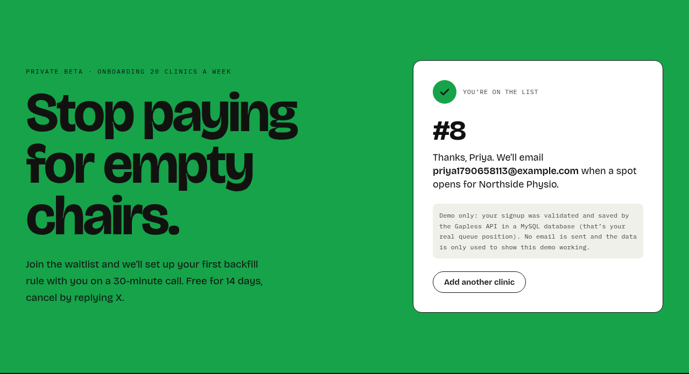
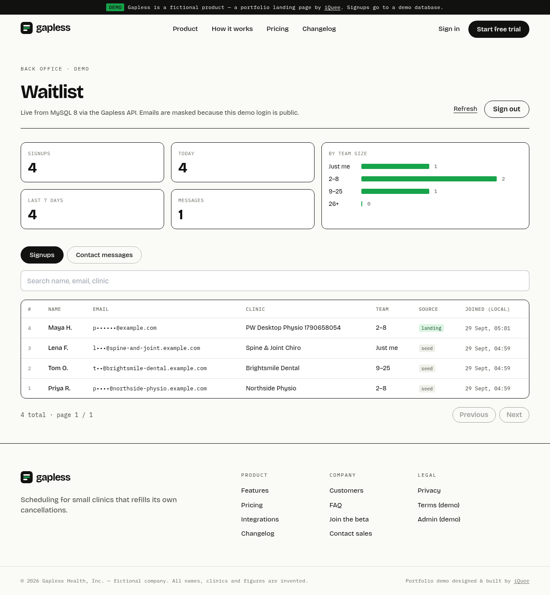
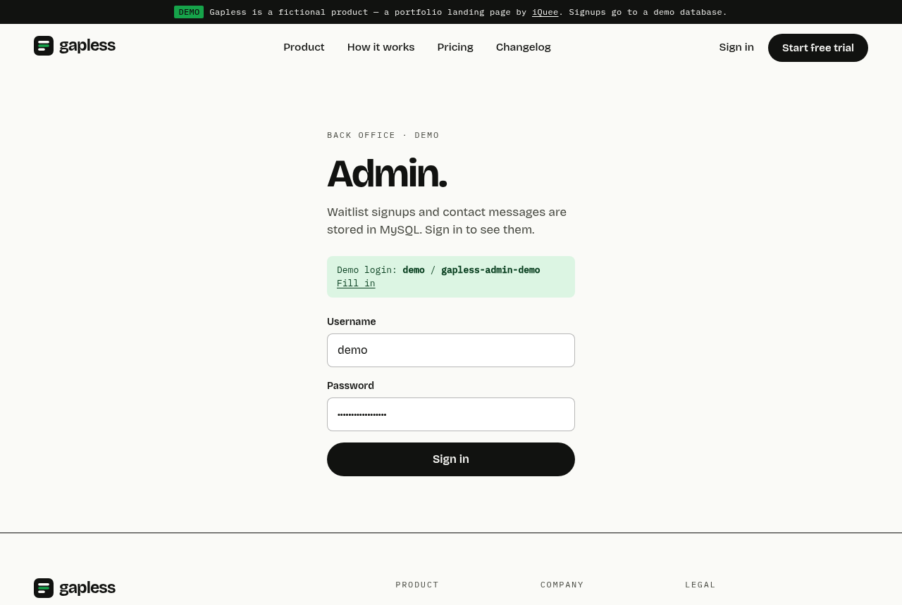
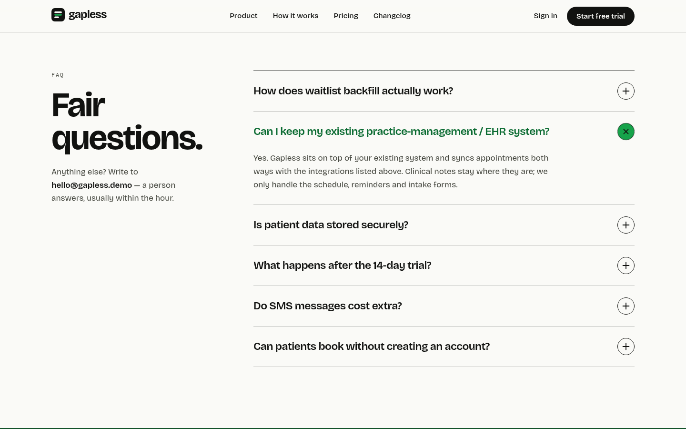
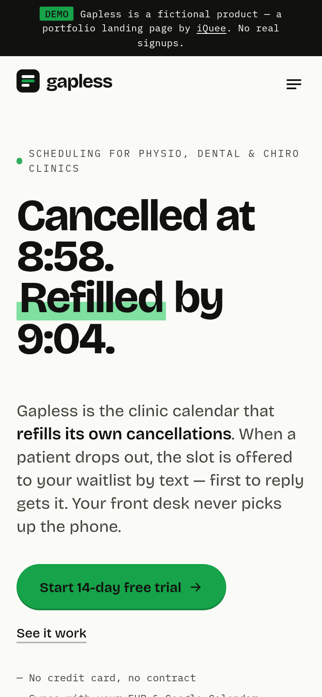

# Gapless — full-stack SaaS landing + waitlist demo by iQuee

A marketing landing site for **Gapless**, a fictional scheduling product for small physio, dental and chiropractic
clinics. Its one big promise: when a patient cancels, the freed slot is automatically texted to the clinic's
waitlist and the first person to reply "Y" gets it — *"Cancelled at 8:58. Refilled by 9:04."*
**Demo only — the product, company, clinics, people, prices and statistics are all invented.** The waitlist and contact
forms are real, though: they post to a **Node.js / Express / Drizzle ORM / MySQL 8** API that validates, de-duplicates,
rate-limits and stores submissions, and a small password-protected admin page lists them. No emails are sent.

- Live: https://saas.iquee.tech · Admin (demo): https://saas.iquee.tech/admin — login **`demo` / `gapless-admin-demo`**
- Repo: https://github.com/wannn28/Saas-iQuee

Built as a portfolio piece for the classic "landing page for my SaaS / startup" brief: a bold light editorial design
(warm white, near-black ink, one signal-green accent, Bricolage Grotesque display type), asymmetric ruled layouts
instead of rows of rounded cards, and product screens built in HTML/CSS rather than stock illustrations.

## What's inside

- **Home (`/`)** — sticky nav with mobile menu · hero with an animated HTML/CSS product mockup (a clinic day calendar
  where a cancelled slot is backfilled, plus an SMS phone thread) and primary CTA · fictional clinic logo strip (text + inline SVG) ·
  problem/solution with a "before vs. after" day-ribbon chart and key figures · **features** with accessible tabs
  (arrow-key navigation) switching between five product screens (waitlist backfill, calendar, reminders, intake forms,
  utilization report) plus an "also in the box" list · how it works (3 steps) · integrations + webhook payload sample ·
  **pricing** with monthly/yearly toggle (per-plan savings shown) and full feature comparison table · testimonials
  (one lead quote + two with stats) · FAQ accordion · final CTA with **waitlist form** · footer.
- **`/pricing`** — plan strip with billing toggle (defaults to yearly), interactive savings/ROI calculator (sliders),
  comparison table, billing FAQ.
- **`/changelog`** — release notes list with versions, dates and New / Improved / Fixed tags.
- **`/privacy`** — placeholder privacy page explaining what the demo stores; `/privacy#terms` placeholder terms.
- 404 page.
- **Waitlist form** — inline validation on blur and on submit (mirrors the server's zod schema), then `POST /api/waitlist`:
  server-side validation with per-field errors, case-insensitive **duplicate email check** (MySQL unique index → 409),
  **honeypot** field, **rate limiting** per client IP, success state with the real **queue position** from MySQL, and a
  live "N clinics on the waitlist" counter (`GET /api/waitlist/count`). Clearly labelled as a demo.
- **`/contact`** — contact-sales form → `POST /api/contact` (same validation / honeypot / rate limit), stored in MySQL.
- **`/admin`** — demo back office behind HTTP Basic auth: stats (total, today, 7 days, by team size), searchable paginated
  signup list and contact messages. Emails are masked in all admin responses because the demo login is public.
- **Motion** — scroll-reveal via a single shared `IntersectionObserver`, hero backfill loop, tab/accordion transitions.
  All of it is disabled under `prefers-reduced-motion` (content is never hidden without JS).
- **Accessibility** — skip link, semantic landmarks and headings, ARIA tabs / radiogroup / accordion patterns,
  visible focus rings, labelled form fields with `aria-invalid` + `aria-describedby`, decorative mockups `aria-hidden`
  with a text description, AA contrast for text (the green is used as a fill behind ink text, deep green for text).
- **Performance** — no UI or animation libraries, no images on the page (mockups are DOM/CSS, icons inline SVG),
  self-hosted subsetted variable font, ~23 kB gzip app JS + ~53 kB gzip React vendor chunk.

## Tech Stack

| Area | Technology (version from `package.json` / installed) |
| --- | --- |
| Frontend framework / language | React 18.3.1 + React DOM 18.3.1, TypeScript 5.6.3 (strict mode) |
| Styling | Tailwind CSS 3.4.19, PostCSS 8.5.28, Autoprefixer 10.6.1; fonts self-hosted via Fontsource — Bricolage Grotesque Variable 5.3.0, IBM Plex Mono 5.3.0 |
| Routing | React Router DOM 6.30.6 (`BrowserRouter`, nested layout route, hash-anchor scrolling) |
| Animation | Plain CSS transitions/keyframes (Tailwind) + native `IntersectionObserver` scroll reveal; respects `prefers-reduced-motion` |
| Backend / API | Node.js 20 + TypeScript, Express 4.22, zod 3.25 validation, helmet 8, CORS allow-list (own domain only), express-rate-limit 7.5 |
| Database | **MySQL 8.4** (utf8mb4), accessed with **Drizzle ORM 0.45 + mysql2 3.24**; schema in TypeScript, versioned SQL migrations generated by drizzle-kit 0.31 and applied on start; idempotent seed |
| Auth (admin) | HTTP Basic auth against env credentials, constant-time comparison, brute-force rate limit |
| Privacy / abuse | Honeypot field, per-IP rate limit, only a salted SHA-256 hash of the IP is stored, masked emails in admin |
| Infrastructure | Docker (multi-stage Alpine image, non-root, healthcheck), Docker Compose (API + MySQL, private network, named volume, no DB port on host) |
| Web server | Nginx serves `dist/` (SPA fallback) and reverse-proxies `/api/` to `127.0.0.1:3005`; Let's Encrypt TLS; Cloudflare in front |
| Build tooling / lint | Vite 5.4.21 (+ @vitejs/plugin-react 4.7.0, dev/preview proxy for `/api`), `tsc -b`; ESLint 9.39.5 + typescript-eslint 8.71.0 |
| QA | Playwright (Python) — `flow.py` (end-to-end: signup → admin → contact), `shots.py`; API smoke test `server/scripts/smoke.mjs` |

**Why Drizzle + mysql2?** A thin, typed SQL layer: the schema is TypeScript (`server/src/db/schema.ts`), migrations are
plain reviewable SQL files (`server/drizzle/`), and aggregate queries (stats by day / team size) stay close to SQL.

## Architecture

```
Browser ──HTTPS──> Cloudflare ──> Nginx (saas.iquee.tech)
                                   ├── /       -> /var/www/iquee-saas (Vite build)
                                   └── /api/   -> 127.0.0.1:3005 ──> [api] Node 20 + Express + Drizzle
                                                                       │  (compose network "internal")
                                                                       └──> [db] MySQL 8.4 (no host port, volume mysqldata)
```

### API

| Method & path | Purpose |
| --- | --- |
| `GET /api/health` | Liveness + DB check |
| `GET /api/waitlist/count` | Number of signups |
| `POST /api/waitlist` `{ name, email, clinic, teamSize: solo\|2-8\|9-25\|26+, website? }` | Join the waitlist → `201 { position, count }`; `400` field errors; `409` duplicate email; `429` rate limited |
| `POST /api/contact` `{ name, email, company?, topic, message, website? }` | Contact-sales message |
| `GET /api/admin/me` · `/stats` · `/signups?page=&q=` · `/contacts?page=` | Admin (HTTP Basic auth) |

Tables: `waitlist_signups` (unique `email`, `team_size` ENUM, `source`, `ip_hash`, `created_at`) and `contact_messages`.

## Run it

Requirements: Node 20+, MySQL 8 (MariaDB 10.6+ also works for local dev) or Docker.

```bash
# API
cd server
cp .env.example .env              # DATABASE_URL, ADMIN_PASSWORD, IP_HASH_SALT
npm install
npm run db:migrate:dev            # applies drizzle/*.sql
npm run db:seed:dev               # 3 fictional sample signups
npm run dev                       # http://localhost:3005/api/health
npm run test:api                  # smoke test (set ADMIN_PASSWORD to include admin checks)
npm run db:generate               # after editing src/db/schema.ts -> new SQL migration

# Frontend (Vite proxies /api -> localhost:3005)
cd ..
npm install
npm run dev                       # local dev server
npm run build                     # type-check + production build -> dist/
npm run lint
npx vite preview --port 4175 &
/workspace/.venv-pw/bin/python flow.py    # E2E against preview (or pass https://saas.iquee.tech)
```

### Production (Docker Compose)

```bash
cp .env.example .env && chmod 600 .env    # fill secrets: openssl rand -hex 24
docker compose up -d --build              # project name iquee-saas; API on 127.0.0.1:3005 only
```

The API container applies migrations, runs the seed and starts; both services use `restart: unless-stopped`, memory
limits and rotated logs. Nginx: `location ^~ /api/ { proxy_pass http://127.0.0.1:3005; ... }` next to the SPA fallback
`location / { try_files $uri $uri/ /index.html; }`.

## Project layout

```
src/
  components/      Layout (nav, demo banner, footer), Pricing (toggle, plan strip, compare table), Faq, SignupForm, Logo, Icons
  components/mock/ HTML/CSS product screens: Frame, Calendar, Phone, Screens (waitlist, reminders, intake, reports)
  sections/        Home page sections (Hero, Logos, Problem, Features, How, Integrations, PricingSection, Stories, FaqSection, FinalCta)
  pages/           Home, PricingPage, Changelog, Privacy, Contact, Admin, NotFound
  data/content.ts  Plans, comparison rows, FAQ, testimonials, integrations, changelog
  lib/             api (fetch wrapper), reveal (scroll animation), backfill (hero loop), format, useTitle
server/
  src/db/          schema.ts (Drizzle tables), client.ts (mysql2 pool)
  src/routes/      public.ts (waitlist, count, contact), admin.ts (Basic auth)
  src/             app.ts, env.ts (zod-validated env), migrate.ts, seed.ts, lib/
  drizzle/         generated SQL migrations
  scripts/         smoke.mjs
  Dockerfile, docker-entrypoint.sh
docker-compose.yml api + MySQL
tools/             og-image / favicon renderer
```

## Screenshots

| Hero | Feature tabs |
| --- | --- |
|  |  |
| **Pricing (yearly)** | **Waitlist signup success** |
|  |  |
| **Admin — signups from MySQL** | **Admin — login** |
|  |  |
| **FAQ** | **Mobile** |
|  |  |

---

Designed and built by [iQuee](https://iquee.tech). Gapless is fictional; see [CREDITS.md](CREDITS.md).
